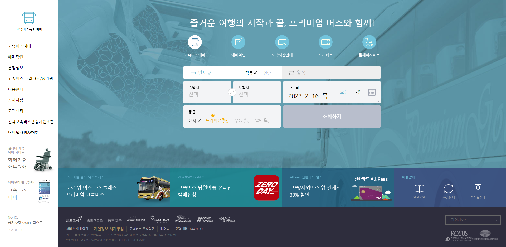
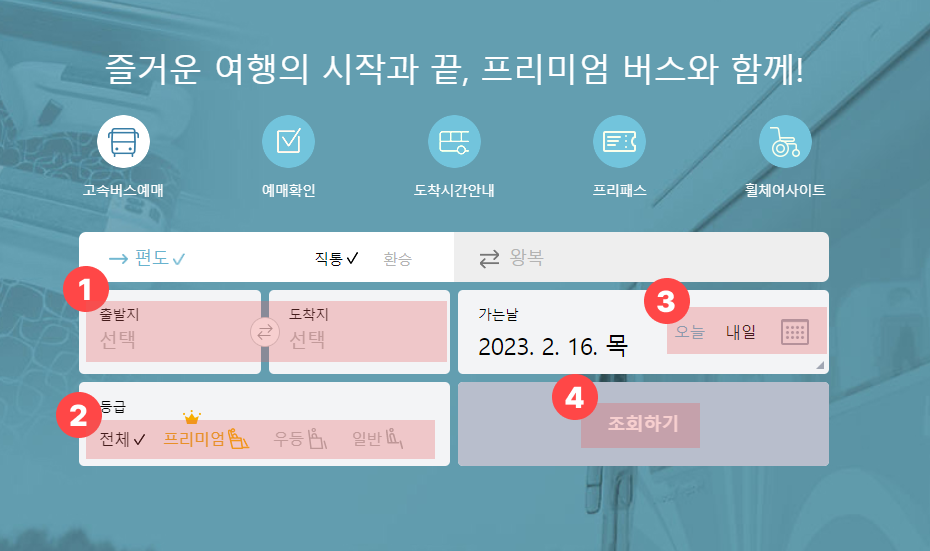
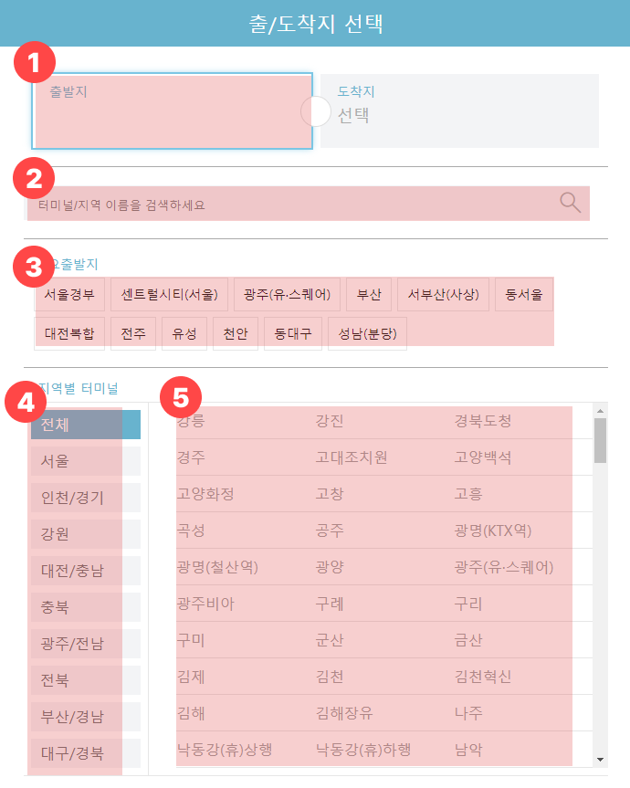
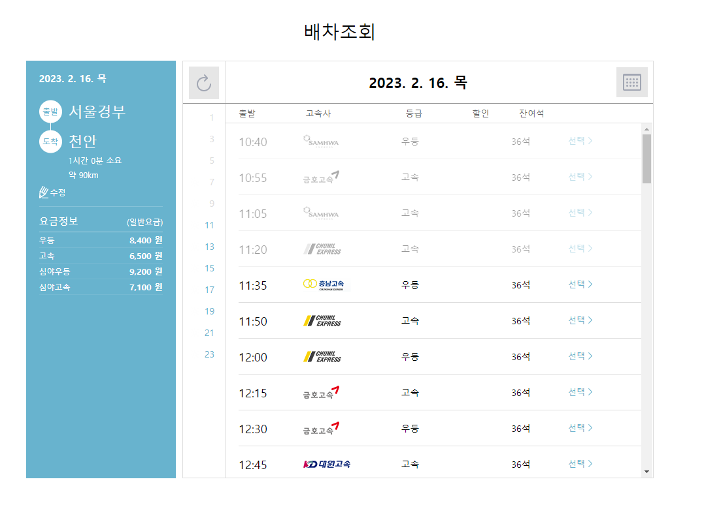

# 고속버스 예매 배차 조회

#### 사용 기술    
#### 작업 기간 - 2023년 2월 8일 → 2023년 2월 15일
#### 작업 유형 - 개인프로젝트(포트폴리오)


## 프로젝트 목표

### redux-toolkit으로 작업하기

💡 **상태 관리가 효율적이면 작업이 더 용이해지지 않을까 생각했다.**

이번 프로젝트는 REST API - URL에 들어가는 값이 조건에 따라 달라지며 state의 변화를
화면에 바로 출력해야 해서 redux-toolkit으로 작업하는 것이 목표였다.

### 실시간으로 REST API 요청하기

💡 현재 시간에서 예매 가능한 목록을 찾아서 출력하는 것에 집중했다.

총 223개의 터미널과 출발지 / 목적지 / 좌석 / 날짜에 따라 달라지는 결과의 경우의 수가
많았기 때문에 실시간으로 원하는 결과를 출력하는 것이 이번 프로젝트의 목표였다.

## 디렉토리 구조


## 페이지 구성 & 주요 로직

## 메인 페이지



- 고속버스 배차 조회를 위해 REST API 통신
- 공식 사이트와 동일한 디자인 styled-components 작업
- **redux-toolkit 사용 프로젝트 전역 상태 관리**

---


## 옵션 선택 박스



**1. 출/도착지 선택 클릭 시 터미널 리스트를 선택하는 모달창 팝업**
    
**2. 좌석 등급 선택 시 해당 state 변경**

- 좌석을 선택하면 onClick ⇒ { dispatch } 날짜 상태 변경
    
**3. datepicker 라이브러리를 활용한 날짜 제어**

- 날짜를 선택하면 onChange ⇒ { dispatch } 날짜 상태 변경

**4. 조회하기 클릭 시 주의 사항 알림 창 팝업 후 배차 조회 페이지로 이동**

---



## 터미널 선택 모달창

### 주요 로직

```jsx
// 모달창 팝업되면 전체 터미널 리스트 출력.
// 전체 터미널 리스트는 조건 없이 모두 고정값이기 때문에 DB에 객체배열로 저장 후 사용
```


**1. 출발지 선택 시 state 변경 → asyncThunk에 id값 전달**

```jsx
    // arrDepTrmlList = DB에 저장된 전체 터미널 리스트.
    <ul>
      {trmlNum === "all"
        ? allDepTrmlList.map((trml) => {
            return (
              <li
                key={trml.terminalId}
                onClick={() => {
    
    // dispatch -> 출발지 정보가 담긴 객체 state로 저장
    // state에서 id값 넘겨 asyncThunk 실행.
    
                dispatch(setTrml(trml));
                dispatch(fetchRoute({ dep: trml.terminalId, date: depDate }));
              }}>
              {trml.terminalNm}
            </li>
          );
        })
    </ul>
```
    
**1-1. createAsyncThunk와 axios로 API 통신**

출발지의 ID로 API 호출 → 도착 가능한 모든 터미널 리스트 반환.

내부에서 현재 시간에 맞춰 필터링 후 프라미스 반환.

( 현재 시간 이후의 모든 터미널 리스트 반환)

```jsx
// busAPI.getRoute의 asyncThunk.js

export const fetchRoute = createAsyncThunk("expRoute/fetchExpRoute", 
async ({ dep, arr, date, list, grade }) => {

	// asyncThunk가 받은 매개변수는 다시 호출 URL에 인수로 전달
const res = await axios.get(busAPI.getRoute(dep, arr, date, list, grade));

  // 날짜가 오늘이면 현재 시간 이후로 운행하는 경로만 필터링.
  // 날짜가 오늘이 아니면 모든 시간 경로 return.
  if (nowTime >= 2300) {
    return result;
  } else {
    const currentRes = result.filter((route) => {
      return route.depPlandTime > depTime;
    });
    return currentRes;
  }
});

export const getExpRoute = createSlice({
 // 슬라이스 내부
});

export default getExpRoute.reducer;
```

**1-2. 반환된 프라미스.filter()로 새로운 배열을 만들고 .sort()로 이름 순 정렬**

**1-3. asyncThunk 상태에 따른 로딩창 / 오류창 조건 출력**
    
**2. 검색창 onChange로 state 변경 →  `.filter() .includes() .map` 메서드 결과 값 출력**

```jsx
// input창에 입력 받은 값을 dispatch로 state에 저장 -> value값으로 return
const showTrml = useSelector((state) => state.showTrml.result);
<input
  type="text"
  placeholder="터미널/지역 이름을 검색하세요"
  value={showTrml}
  onChange={(e) => dispatch(findTrml(e.target.value))}
/>

// 삼항 연산자와 논리 연산자로 리스트 조건 출력.
// input에 값이 입력되면 li가 노출

{showTrml &&
// 터미널 이름이 input의 입력값을 포함하면 map으로 렌더링
  alignRoute
    .filter((trml) => trml.terminalNm.includes(showTrml))
    .map((result) => {
      return (
        <li
          key={result.terminalId}

// 검색된 리스트 클릭 시 input값 초기화, 도착지 state 변경
          onClick={() => {
            dispatch(setArrTrml(result));
            dispatch(findTrml(""));
          }}>
          검색한 터미널 이름 출력
        </li>
      );
    })}
```

**3. 주요출발지 클릭 시 출발지 state 변경 → asyncThunk 실행**
    
**4. 삼항연산자로 조건에 맞는 리스트 출력**

- 데이터 id값 8번째 번호 → 지역 번호인 것을 활용.

**5. 도착지 선택 시 도착지 state 변경 → 모달창 닫음**

 - 경로 API 데이터에는 ID값이 없어서 리듀서 내부에서 ID가 있는 객체를 찾아 state 변경

```jsx
// 도착지 리스트인 li를 클릭하면 도착지 state에 해당 객체를 전달하는데
// 전달되는 객체는 경로 통신으로 받은 객체라서 터미널의 id값이 없기 때문에
// Slice 내부에서 id값이 있는 객체로 바꿔서 저장

// 경로 API의 데이터 구조
// {출발시간, 도착시간, 출발터미널이름, 도착터미널이름, 가격, 등급, 날짜}

// ID값이 있는 데이터 구조
// {터미널 이름, 터미널 ID}

// 클릭한 도착지 리스트
<li onClick={() => {
dispatch(setArrTrml("asycThunk로 받은 객체 배열의 해당 객체"))
}}>도착지 리스트</li>

// 도착지 slice의 리듀서
setArrTrml: (state, action) => {
  // 인자로 들어온 객체를 전체 터미널과 비교해서
  // Id가 있는 객체 배열 데이터를 찾아 저장
  const arrInfo = action.payload;
return
  const findArrTrml = allDepTrmlList.find(
    (item) => item.terminalNm === arrInfo.arrPlaceNm
  );
  state.data = findArrTrml;
  state.status = false;
  state.name = findArrTrml.terminalNm;
},
```


사용자가 모든 옵션을 선택했을 때의 화면.

**6. 조회하기를 누르면 `navigate(배차조회 페이지)`로 이동된다.**

---



## 배차 조회 페이지

**주요 로직**

**1. 처음 호출했던 도착지 리스트를 옵션에 맞게 가공**

 - 현재 프라미스 = 출발지에서 도착 가능한 모든 데이터
 - `.filter()와 .includes()` 논리 연산자로 도착지, 버스 등급에 맞는 목록만 필터링

```jsx
  let filterTrml = [];

// undefined 반환 오류 방지 if문
// 현재 routeRes = 도착 가능한 모든 터미널
  if (routeRes === undefined) {
		return;
  } else {
    filterTrml = routeRes.filter((route) => {
      return route.arrPlaceNm === arrTrml.data.terminalNm

// 전체 등급을 불러오는 URL 옵션이 없어서 includes 사용. 
// 등급 미선택 시 busGrade = "";
			&& route.gradeNm.includes(busGrade);
    });
  }
```

**2. 날짜 state가 실제 날짜와 같으면 현재 시간 이전 목록 → disabled 클래스 추가**
    
**3. 고속사 정보 →  `Math.trunc(Math.random())` 랜덤 출력**

**4. asyncThunk 상태, 호출된 리스트.length로 오류 사항 조건 렌더링**

```jsx
// pending 상태도 고려해야 하기 때문에 !== 사용

<li>
  {routeStatus !== "failed" && alignTrml.length !== 0 ? (

		// 프라미스가 준비중이거나 성공했고 옵션에 맞는 목록도 있다면
    // 옵션에 맞는 도착지 출력.

  ) : alignTrml.length === 0 && busGrade ? (

    // 프라미스가 실패하지 않았고 busGrade가 전체가 아니면 true
		// busGrade에 맞는 목록이 없다는 뜻이므로 좌석 변경 여부를 묻는 텍스트 출력

  ) : (
    <ul className="fetchFailed">
      <li>
        도착 정보를 찾을 수 없습니다.
        <span>
          오늘 날짜부터 2일까지 검색 가능합니다.
          <br /> 다시 검색해주세요.
        </span>
      </li>
    </ul>
  )}
</li>
```

**5. 소요 시간 / 좌석 정보 / 요금 정보 → 호출한 데이터를 수정 후 출력**


## 6. 문제 및 해결

## 10,000번의 API 요청 제한을 map 한 방으로 채워봤습니다


### 문제 발생

 **각 터미널이 어디를 갈 수 있는 지 알 수 있는 방법이 없다**

고속 버스 API에는 출발지와 도착지의 경로를 구하는 URL은 있지만 각 터미널이 어느 목적지를 갈 수 있는 지는 알 수가 없었다.
그렇다고 총 229개의 터미널을 일일이 확인해서 정리하기에는 시간이 없었다.

### 원인 파악

 **경로를 구하는 URL을 활용해서 원하는 정보만 골라내보자**

아주 단순한 생각에서 시작한 작업은 총 229개의 터미널 리스트를
map으로 돌려 출발지와 목적지를 비교하고자 했다.

이 작업이 끝나기 전에는 공공API에 요청 횟수 제한이 있는 줄도 몰랐다.


```jsx
// 경로 요청하는 URL에 출발지와 목적지를 매개변수로 넣어서 map을 돌리자
getRoute = (dep, arr) =>
    `http://apis.data.go.kr/1613000/ExpBusInfoService/getStrtpntAlocFndExpbusInfo?serviceKey=${
      appKey.encoding
    }&depTerminalId=${dep}&arrTerminalId=${arr}&depPlandTime=230217&numOfRows=10&pageNo=1&1&_type=json`,

const 전체터미널목록 = [{총 229개의 객체가 담긴 배열},]

// 심지어 두 번째 매개변수는 뒤로 계속 밀릴 뿐 모든 경우의 수를 가져오지도 못하는 식이다.
// 사실 이 때까지는 그냥 에러가 나면 방법을 바꿔 볼 생각이었다.

전체터미널목록.map((trml, idx) => {
try {
	const res = axios.get(trml.terminalNm, trml[idx + 1].terminalNm);
	return res.data.response.body.items.item
} catch(err){
	alert(err, "데이터 요청에 실패했습니다");
}
});
```

 **개발자 도구 콘솔창에 에러가 계속 올라간다**

map 한 번으로 API 요청 횟수 제한이 걸려 결국 이 날은 작업을 하지 못했지만 나에게는 내일이 있다…


### 문제 해결

 **공식 사이트에서 각 터미널마다 목적지를 확인해서 DB로 만드는 
가내수공업은 어떨까**

그러기엔 시간이 너무 없었지만 이 문제에 막힌 지 3일 째 되는 날에는
”진작 했으면 이미 끝나지 않았을까?’ 살짝 고민을 해보기도 했다.

 **요청 URL에 출발지만 입력하면 모든 목적지와 모든 시간 경로가 리턴되는 
걸 알아냈다**

공공 API 설명에 목적지는 필수 항목이었기 때문에 이 방법을 찾는데 생각보다 오래 걸렸다.
처음 출발지를 선택하면 그 정보만 state로 저장해서 url로 넘겨 원하는 결과를 얻어냈다.

```jsx
// 출발지에서 도착 가능한 모든 경로를 불러온 다음 asyncThunk 내부에서 재가공해서 사용했다.
// 로딩 시간이 있지만 최대한 모든 경로를 불러와야 했기에 8000개의 목록을 요청했다.

export const fetchRoute = createAsyncThunk("expRoute/fetchExpRoute", async ({
매개변수: 출발지, 날짜: 오늘, 불러올 리스트 목록: 8000개 }) => {

  // res = 도착 가능한 모든 터미널

  const res = await axios.get(busAPI.getRoute(dep, arr, date, list, grade));
  const result = (res === undefined) ? [] : res.data.response.body.items.item;

  // 날짜가 오늘이면 현재 시간 이후로 운행하는 경로인 currentRes 리턴.
  // 날짜가 오늘 이후면 모든 시간 경로 리턴.
  if (nowTime >= 2300) {
    return result;
  } else {
    const currentRes = result.filter((route) => {
      return route.depPlandTime > depTime;
    });
    return currentRes;
  }
});
```

---

## 구글에서 다들 sort()를 알려주는데 왜 나만 안되는가?

### 문제 발생

 **힘들게 불러온 도착지 목록이 정렬이 안되어있다. 근데 .sort() 메서드는 오류만 발생한다.**

### 원인 파악

 **redux-toolkit은 처음이라…immutable이 뭐지?**

.sort() 메서드는 새로운 배열로 복사하는 게 아니라 원배열이 수정되는 메서드라서 redux의 불변성과 충돌이 일어나 생기는 오류였다.

수정하고자 하는 배열이 객체 배열이었는데 useSelector로 state를 변수로 선언한다고 해도 Slice 내부에 있는 객체의 위치를 참조할 뿐이라 건드리면 원배열을 수정하는 게 되기 때문.

```jsx
const 정렬해야하는객체배열 = useSelector(state => state.도착터미널.data);

정렬해야하는객체배열.sort((a, b) => {
  if (a.arrPlaceNm > b.arrPlaceNm) return 1;
  if (a.arrPlaceNm < b.arrPlaceNm) return -1;
  return 0;
});

// 정렬해야하는객체배열은 새로운 배열이 아니라 Slice 내부의 객체를 참조하는 배열이다.
```

### 문제 해결

 **마침 중복된 터미널을 제거해야 해서 .filter메서드로 새로운 배열을 만들어 해결했다.**

```jsx
// 호출된 도착지 리스트를 .filter()로 중복된 객체를 제거하고 새로운 배열로 반환.
const currentRoute = 호출된도착지리스트.filter((trml, idx, route) => {
    return route.findIndex((item) => item.arrPlaceNm === trml.arrPlaceNm) === idx;
  });

// 새로운 배열로 반환된 currentRoute에 .sort()를 돌려 해결.
  const 정렬된도착지리스트 = 새로생성된filter배열.sort((a, b) => {
    if (a.arrPlaceNm > b.arrPlaceNm) return 1;
    if (a.arrPlaceNm < b.arrPlaceNm) return -1;
    return 0;
  });
```

---

## 라이브러리 설명이 너무 불친절한 것 아닙니까?

### 문제 발생

 **datepicker 라이브러리를 사용했는데 공식 사이트에서 알려준 속성에서 오류 발생**

고속버스 예매 날짜 선택을 하는 달력이라 지난 날짜는 비활성화를 해야 되는데

공식 사이트에 나와있는 속성을 찾을 수 없다는 오류가 자꾸 발생한다.

**심지어 css도 적용이 안돼서 달력이라고 볼 수가 없다.**


### 원인 파악


 **공식 사이트가 아닌 것 같습니다 죄송합니다.**

css부터 해결하려고 검색하다가 제대로 된 npm 공식 사이트를 찾았다 친절하게도 설명이 매우 잘 되어있었다.


### 문제 해결

 **스타일은 css파일을 import하고 지난 날짜 비활성화는 npm i date-fns로 
해결.**

minDate 속성은 구글 검색을 통해 date-fns를 설치하니 해결됐는데

애초에 date-fns가 필요하다는 말은 datepicker에 없어서 이 문제의 원인은 아직 모르겠다.

```jsx
$ npm i date-fns
```

---

## 홈이랑 배차 조회 페이지랑 datepicker의 선택된 날짜가 다르다


### 문제 발생

 **배차 조회 페이지로 넘어가면 datepicker의 날짜가 자꾸 초기화 된다.**


### 원인 파악

 **datepicker의 selected 속성 때문에 자꾸 초기화 되는 문제**

datepicker는 하나의 함수형 컴포넌트로 페이지가 넘어가면 새로 렌더링이 되면서

selected 속성에 적용된 new Date()로 날짜가 초기화되는 게 원인.


### 문제 해결

 **배차 조회 페이지용 datepicker를 만들었는데 서로 동기화가 안된다**

datepicker는 내부에서 useState로 스스로 상태를 관리

→ 1번 datepicker의 상태를 2번에 넘겨야 하기 때문에 reducer를 만들어 값을 넘기니

→ **new Date()가 redux의 불변성과 또 충돌했다.**

 **new Date()를 JSON.stringify()로 변환해서 넘기고 JSON.parse로 받아서 
처리**

다행히 JSON 문자열은 state로 저장이 가능했다.
→ new Date()를 JSON문자열로 저장하고 다시 변환해서 불러온 다음
→ 그 값을 new Date(변환된 값)에 매개변수로 전달해서 날짜를 복구했다.

```jsx
// 1번 datepicker
dispatch(inputNewDate(JSON.stringify(date)));
// 날짜가 바뀌면 date 슬라이스의 newDate 스테이트를 JSON문자열(new Date())로 변경.

// 2번 datepicker
const newDateRes = useSelector((state) => state.getDate.newDate);
// JSON문자열 state를 불러와서

const parseDate = JSON.parse(newDateRes);
// 다시 자바스크립트 값으로 변경.

const newDate = new Date(parseDate);
// 변경된 값을 new Date에 전달하면 new Date 객체 형태의 값 완성.

const [startDate, setStartDate] = useState(newDate);
// 2번 datepicker의 시작 값이 되는 statDate에 setState해서 해결.
```

---

## 날짜를 바꿨을 뿐인데 왜 자꾸 오류가 발생하지?
 

### 문제 발생

 **배차 조회 페이지에서 날짜를 변경하면 바뀐 날짜로 리스트 출력이 안되고 오류 발생.**


### 원인 파악

 **datepicker 문제인 줄 알고 4시간을 헤맸는데…**

원인은 너무 먼 날짜로 API를 호출하면 값이 undefined로 넘어오는 게 아니라

호출 자체를 실패하고 asyncThunk의 상태가 rejected가 되는데
 
**→ map은 데이터가 넘어온 줄 알고 실행되니 오류가 발생한 것.**

### 문제 해결

 **삼항연산자와 논리연산자로 asyncThunk의 상태를 비교해 JSX 구문을 제어.**


```jsx
{fetchStatus === "success" && alignRoute.length === 0 ? (

// API 호출이 성공했으나 현재 시간에 맞춰 필터링된 배열이 없으면 출력.
  <strong>현재 시간 예매 가능한 터미널이 없습니다.</strong>

) : fetchStatus === "failed" ? (

// API 호출이 실패하면 출력.
  <strong>
    선택하신 날짜로 검색되는 터미널이 없습니다.
    <br />
    평균 1일 ~ 최대 2일 후까지 검색 가능합니다.
  </strong>
) : null}
```

---

## 다 끝내고 Github로 배포했더니 왜 또 오류가??

### 문제 발생

 **로컬에서 제대로 작동되는지 다 확인하고 github를 통해 배포하니까 오류 발생**


### 원인 파악

 **https에서 http로 API를 요청해서 생긴 Mixed Content 오류**

암호화된 HTTPS 페이지에서 암호화되지 않은 HTTP를 통해 요청할 때 발생하는 에러로

생각보다 많은 분들이 겪는 문제였는지 금방 해결할 수 있었다.


### 문제 해결

 **index.html에 아래의 메타 태그를 넣어서 해결.**


```jsx
<meta http-equiv="Content-Security-Policy" content="upgrade-insecure-requests" />
```

# 프로젝트 후기

### 관리할 state가 많으면 이름 짓는 게 너무 너무 중요하다.

이번 프로젝트로 배운 점이다.

상태 관리가 용이한 redux로 작업을 하더라도 이름을 지을 때는 나름의 규칙이 필요함을 느꼈다.

지금까지의 작업 중 가장 복잡하고 어려웠지만, redux-toolkit을 조금 더 이해할 수 있었고

오픈 API 활용해서 다양한 프로젝트를 만들어 보면 재밌을 것 같다는 생각이 들었다.

문제는 마주할수록 하나를 더 배우기에 부족함을 경험으로 바꿀 수 있는 프로젝트였다.

# 🚌[프로젝트 바로가기](https://frdytheme.github.io/multibus/)

[고속버스API기반 고속버스예매](https://frdytheme.github.io/multibus/)
